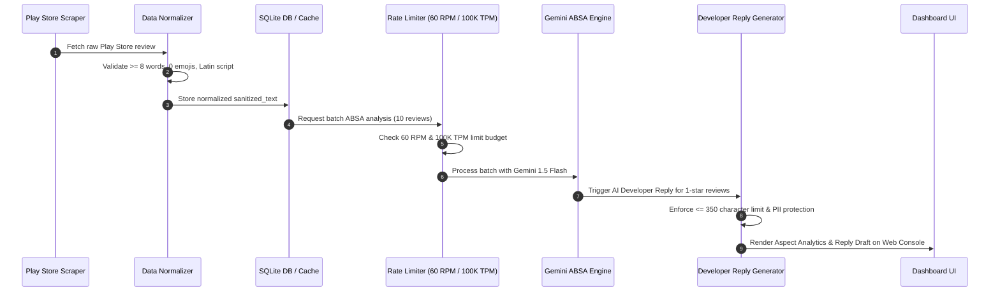

# Zepto Reviews AI — System Architecture & Component Design

**Project Title:** Zepto Reviews AI  
**Domain:** Quick Commerce (Q-Commerce) / AI Analytics & Operational Execution  
**Active Scope:** Google Play Store Reviews (`com.zepto.customer`)  
**Document Version:** 1.3.0  
**Status:** Approved Architectural Baseline  

---

## 1. Executive Summary

Zepto Reviews AI is an enterprise-grade AI analytics and automated developer reply platform engineered to ingest, sanitize, analyze, and act upon Google Play Store customer reviews for Zepto (`com.zepto.customer`).

The system features:
* **Zero-Trust PII Masking Engine**: Redacts customer phone numbers, emails, order IDs, and residential addresses (`[PHONE_REDACTED]`, `[EMAIL_REDACTED]`, `[ORDER_ID_REDACTED]`, `[ADDRESS_REDACTED]`).
* **Phase 1 Data Normalizer**: Filters out short reviews ($< 8$ words), emojis, and non-Latin scripts, maintaining a clean 5,000-review corpus.
* **Google AI Studio Rate Limiter**: Enforces strict **60 RPM (Requests Per Minute)** and **100,000 TPM (Tokens Per Minute)** throughput controls with 10-review prompt batching (~600 reviews/min throughput).
* **Phase 2 Aspect-Based Sentiment Analysis (ABSA)**: Classifies customer sentiment across 5 Play Store aspect categories.
* **AI Developer Reply Generator**: Generates context-aware responses strictly constrained to **$\le 350$ characters** for the Google Play Developer Console.

---

## 2. System Architecture (C4 Model)

```mermaid
C4Context
    title System Context Diagram — Zepto Reviews AI (Phase 2 ABSA & Reply Gen)

    Person(customer, "Zepto App User", "Submits Play Store reviews.")
    Person(cx_agent, "Zepto CX / Product Lead", "Monitors BI dashboard & approves developer replies.")

    System_Boundary(zepto_ai, "Zepto Reviews AI System") {
        System(ingestion_api, "Play Store Ingestion Connector", "Scrapes & normalizes Play Store reviews.")
        System(pii_engine, "PII Sanitizer & Data Normalizer", "Redacts PII & enforces >= 8 words, 0 emojis rule.")
        System(rate_limiter, "Google AI Studio Rate Limiter", "Throttles calls to 60 RPM & 100K TPM.")
        System(absa_engine, "Gemini ABSA Engine", "5-Aspect sentiment classification (-1.0 to +1.0).")
        System(reply_gen, "AI Developer Reply Generator", "Generates <= 350 character Play Store responses.")
        System(cache_db, "SQLite DB & Cache Manager", "Serves 5,000 normalized reviews & reviews_cache.json.")
    }

    System_Ext(google_play, "Google Play Store API", "Source of reviews & target for developer replies.")
    System_Ext(gemini_api, "Google AI Studio (Gemini 1.5 Flash)", "LLM inference engine (60 RPM, 100K TPM max).")

    Rel(customer, google_play, "Submits review")
    Rel(ingestion_api, google_play, "Fetches reviews (com.zepto.customer)")
    Rel(ingestion_api, pii_engine, "Passes raw text")
    Rel(pii_engine, cache_db, "Persists normalized sanitized reviews")
    Rel(cache_db, rate_limiter, "Loads 10-review batches")
    Rel(rate_limiter, gemini_api, "Submits batch prompts (<= 60 RPM, <= 100K TPM)")
    Rel(gemini_api, absa_engine, "Returns 5-Aspect classification")
    Rel(absa_engine, reply_gen, "Triggers <= 350 char response generation")
    Rel(cx_agent, zepto_ai, "Monitors dashboard & approves replies")
```

---

## 3. Google AI Studio LLM Rate Limit & Batching Strategy

```
+---------------------------------------------------------------------------------------------------------+
|                    GOOGLE AI STUDIO (GEMINI 1.5 FLASH) RATE LIMIT SPECIFICATIONS                        |
+------------------------------------+-----------------------+--------------------------------------------+
| Constraint Metric                  | Rate Limit Threshold  | System Optimization Strategy               |
+------------------------------------+-----------------------+--------------------------------------------+
| **Requests Per Minute (RPM)**      | **60 RPM** (1 req/s)  | Async Leaky Bucket delay (min 1.0s gap)   |
| **Input Tokens Per Minute (TPM)**  | **100,000 TPM**       | Token window tracking (~15k tokens/min)    |
| **Batch Size per LLM Call**        | **10 Reviews / Batch**| Reduces total API calls by 90%             |
| **Effective Ingestion Throughput** | **600 Reviews / Min** | 5,000 reviews processed in ~8.3 minutes   |
| **Developer Reply Length Constraint**| **&le; 350 Characters**| Enforced for Google Play Developer Console |
+------------------------------------+-----------------------+--------------------------------------------+
```

---

## 4. Phase 2 ABSA 5-Aspect Taxonomy

The ABSA engine (`backend/gemini_absa_engine.py`) categorizes every normalized review into 1 of 5 aspect categories:

1. **App UX & Technical Performance**: Crashes, freeze, OTP delay, payment screen bugs, location pin errors.
2. **Delivery Speed & Rider Behavior**: Delayed delivery, rude riders, floor refusal, fast 7-min delivery praise.
3. **Product Quality & Packaging Spoilage**: Leaking curd/milk, torn packets, spoiled meat, rotten veggies.
4. **Pricing, Surge & Refund Delays**: Double charging, surge delivery fee complaints, uncredited promo codes.
5. **Non-Core Category Adoption Friction**: Friction in Electronics, Fresh Meat, Beauty/Cosmetics, Zepto Cafe.

---

## 5. Developer Reply Generator Specifications (`backend/developer_reply_generator.py`)

* **Maximum Character Limit**: **350 characters** (Strictly enforced; returns error if $> 350$ chars).
* **Tone Modulation**:
  * *1–2 Star Reviews*: Empathetic, urgent acknowledgment, zero excuses, resolution commitment.
  * *3 Star Reviews*: Constructive feedback gratitude, performance improvement assurance.
  * *4–5 Star Reviews*: Warm appreciation, delight reinforcement.
* **PII Protection Guarantee**: 100% guarantee that zero customer PII (phone, email, order ID, address) is echoed in the reply.

---

## 6. End-to-End Execution Sequence


