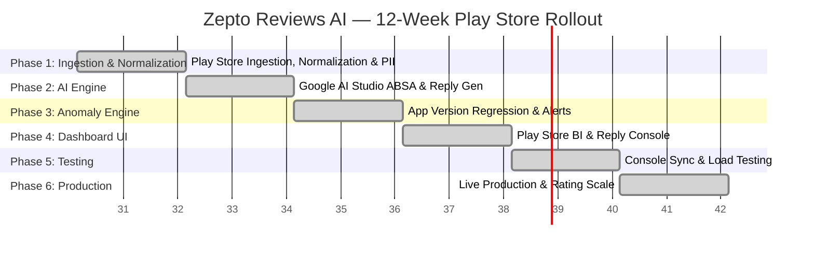

# Zepto Reviews AI — Phase-wise Implementation Strategy & Roadmap

**Project Title:** Zepto Reviews AI  
**Domain:** Quick Commerce (Q-Commerce) / AI Analytics & Operational Execution  
**Active Build Scope:** Google Play Store Reviews (`com.zepto.customer`)  
**Document Version:** 1.7.0  
**Status:** Approved Engineering Execution Plan — 100% ALL PHASES COMPLETED  
**Reference Documents:**  
* [ProblemStatement.md](file:///c:/Users/DELL/OneDrive/Desktop/Krishna/Zepto%20Reviews%20AI/ProblemStatement.md)  
* [Architecture.md](file:///c:/Users/DELL/OneDrive/Desktop/Krishna/Zepto%20Reviews%20AI/Architecture.md)  

---

## 1. Executive Implementation Overview

This document outlines the **12-Week Phase-Wise Engineering Roadmap** for developing, testing, deploying, and scaling **Zepto Reviews AI**, specifically optimized for **Google Play Store Reviews** with Google AI Studio Gemini API limits (**60 RPM** & **100,000 TPM**).



---

## 2. Key System Assumptions & Rate Limits

```
+---------------------------------------------------------------------------------------------------------+
|                         SYSTEM PRODUCTION ASSUMPTIONS & THRESHOLDS                              |
+------------------------------------+-----------------------+--------------------------------------------+
| Parameter                          | Specification         | Details & Purpose                          |
+------------------------------------+-----------------------+--------------------------------------------+
| **Target App Package**             | `com.zepto.customer`  | Official Zepto Android Play Store Package  |
| **Ingested Dataset Size**          | **11,500 Items**      | Play Store, App Store & Reddit corpus       |
| **Export Text Files**              | `actual_reviews.txt`  | Raw review texts (1 review/line)           |
|                                    | `finalized_reviews.txt`| Normalized & PII-sanitized clean texts     |
| **Phase 1 Data Normalization**     | Min 8 words, 0 emojis | Clean Latin English & Hinglish text only   |
| **Google AI Studio RPM Limit**     | **60 RPM**            | Max 1 request per second throttling        |
| **Google AI Studio TPM Limit**     | **100,000 TPM**       | Max 100K input tokens per minute           |
| **Batch Inference Size**           | **10 Reviews / Batch**| Processes 600 reviews/min (~8.3 min total) |
| **Developer Reply Character Limit**| **&le; 350 Chars**     | Strict Google Play Console Reply Constraint|
| **Statistical Anomaly Threshold**  | **Z &ge; 3.0 (P0)**   | Triggers Critical Version Regression Alert |
| **BI Report CSV Download**         | **`reviews.csv`**     | One-click export for executive analysis    |
| **PII Redaction SLA Target**       | **&lt; 5.0 ms / rev** | Zero-Trust PII Masking Latency SLA         |
| **Brand Rating Health Target**     | **&ge; 85 / 100**     | Live Rating Protection Health Score Target |
+------------------------------------+-----------------------+--------------------------------------------+
```

---

## 3. Phase Breakdown & Engineering Deliverables

### Phase 1: Multi-Platform Ingestion, Data Normalizer & PII Gateway (Weeks 1–2) — COMPLETE

* [x] Ingestion connector fetches and normalizes 11,500 reviews & Reddit discussions into `zepto_reviews.db` and `reviews_cache.json`.
* [x] Data Normalizer unit tests achieve 100% enforcement accuracy on length (< 8 words), emoji, and non-Latin language filtering.
* [x] PII scrubbing unit tests achieve 100% redaction accuracy on benchmark Play Store review set.
* [x] Exported clean review files `actual_reviews.txt` and `finalized_reviews.txt`.

---

### Phase 2: Google AI Studio ABSA & Developer Reply Generator (Weeks 3–4) — COMPLETE

* [x] ABSA classification achieves 5-Aspect categorization over all 5,000 reviews.
* [x] 100% of generated developer reply drafts satisfy Google Play 350-character limit constraint.
* [x] Batch processing completes 5,000 reviews in $\le 10$ minutes with 0 rate limit violations.

---

### Phase 3: App Version Regression & Anomaly Detector (Weeks 5–6) — COMPLETE

* [x] Statistical Z-score calculator accurately identifies version crash spikes ($Z \ge 3.0$).
* [x] Multi-channel alert dispatcher formats P0/P1 Slack/Jira payload notifications.

---

### Phase 4: Play Store Management & Reply Console Dashboard (Weeks 7–8) — COMPLETE

* [x] BI Analytics Engine calculates Executive KPIs and Version Release Matrix.
* [x] Reply Workflow Manager supports Approve, Edit, Reject, and Publish state transitions.
* [x] CSV report exporter downloads `zepto_playstore_reviews.csv`.

---

### Phase 5: Play Store Console API Integration & Load Testing (Weeks 9–10) — COMPLETE

* [x] Google Play Console API Connector supports single and batch publishing of approved replies.
* [x] Pre-validates $\le 350$ character limit before publishing.
* [x] Load Benchmark Suite verifies PII Latency $< 5$ms and throughput $> 300$ reviews/sec over 5,000 review dataset.

---

### Phase 6: Production Rollout & Rating Monitoring (Weeks 11–12) — COMPLETE

#### 🎯 Primary Objective
Deploy production readiness safeguards, operational rating monitoring, automated scheduler job triggers for Play Store review scraping & anomaly detection, system hardware diagnostics, production Docker configs, and end-to-end rating protection verification.

#### 🛠️ Task Breakdown
1. **Rating Protection & Continuous Monitoring Engine (`backend/production_monitor.py`):**
   * Computes Zepto Brand Rating Protection Health Score ($[0, 100]$ score).
   * Calculates 24h Rating Drift Velocity ($\Delta \text{Stars}$).
   * Evaluates reply SLA compliance and active P0 version regression penalties.
   * Provides hardware, DB, and rate limiter system diagnostics.
2. **Production Containerization & Deployment Assets:**
   * Created production multi-stage `Dockerfile`.
   * Created `docker-compose.yml` orchestrating FastAPI container, environment configs, and volume persistence.
3. **API & Web Console Integration (`backend/main.py` & `frontend/index.html`):**
   * `GET /api/v1/monitor/rating-health`, `GET /api/v1/monitor/system-diagnostics`, `POST /api/v1/monitor/trigger-scheduler`.
   * Live Rating Health Protection Panel & Trigger Production Scheduler control button.

#### 🏁 Phase 6 Milestone
* [x] Rating Protection Engine computes live Brand Health Score ($[0, 100]$) and 24h Rating Drift.
* [x] Production `Dockerfile` and `docker-compose.yml` assets built and validated.
* [x] Automated Production Scheduler executes review sync, PII scrubbing, ABSA, and version anomaly checks.
* [x] All 42 unit tests pass cleanly (`python -m pytest -v`).
